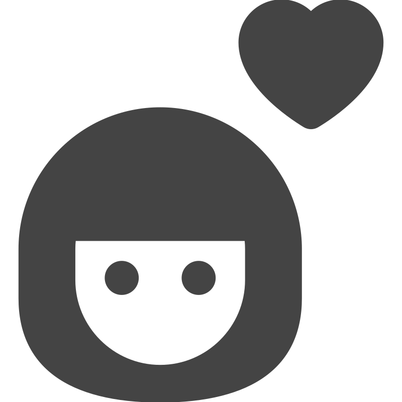
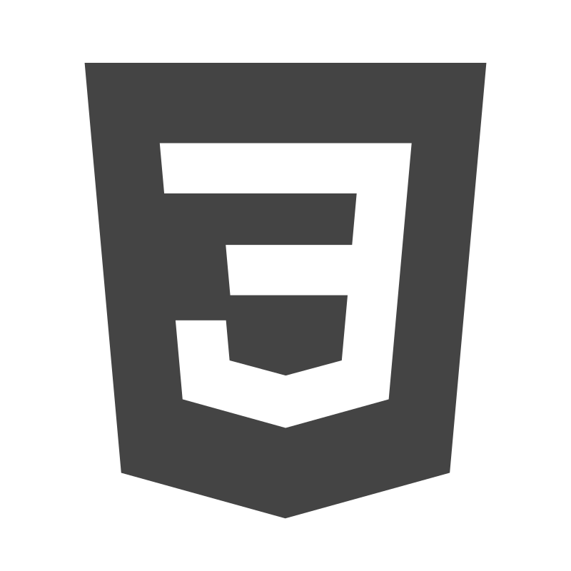
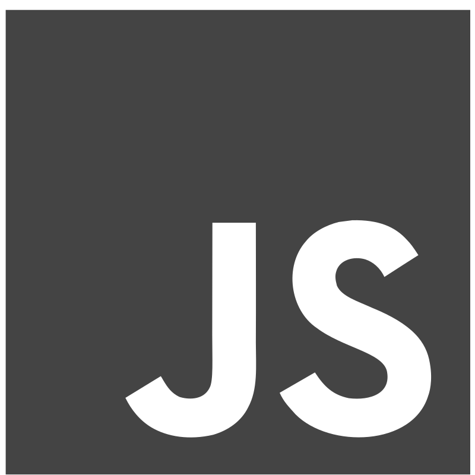
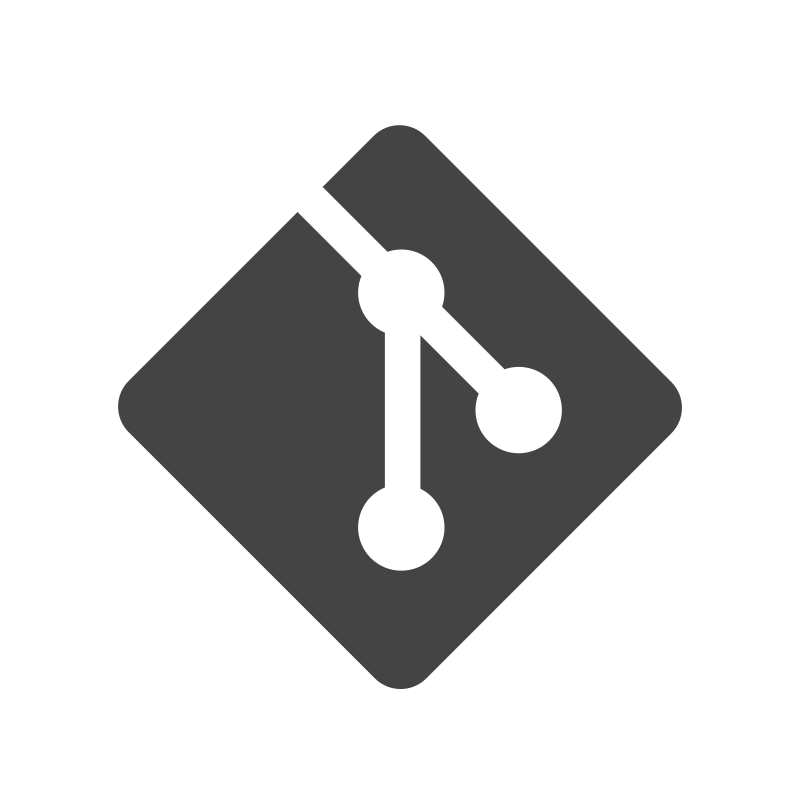

hello, world!
# I'm jr FRONTEND DEVELOPER  

### ✦ with a goal to build beautiful, user-friendly, and efficient web applications

*I believe that a good interface is just as much about functionality as it is about aesthetics, and I strive to create websites and applications that deliver the best user experience*

### ✦ study at [The Rolling Scopes School](https://rs.school/) — the best school for developers ever 

*Here, I receive quality education and learn best practices and technologies used in real-world projects*

## My Toolbox:

and this is just a beginning...

## Projects:

➥ [AUDIO PLAYER](https://rolling-scopes-school.github.io/l-liubou-JSFEPRESCHOOL2024Q2/audio-player/)

➥ [IMAGE GALLERY](https://rolling-scopes-school.github.io/l-liubou-JSFEPRESCHOOL2024Q2/image-gallery/)

➥ [SIMON SAYS](https://rolling-scopes-school.github.io/l-liubou-JSFE2024Q4/simon-says/)

➥ [CHRISTMAS SHOP](https://rolling-scopes-school.github.io/l-liubou-JSFE2024Q4/christmas-shop/)

➥ [SHELTER](https://rolling-scopes-school.github.io/l-liubou-JSFEPRESCHOOL2024Q2/shelter/pages/main/index.html)
